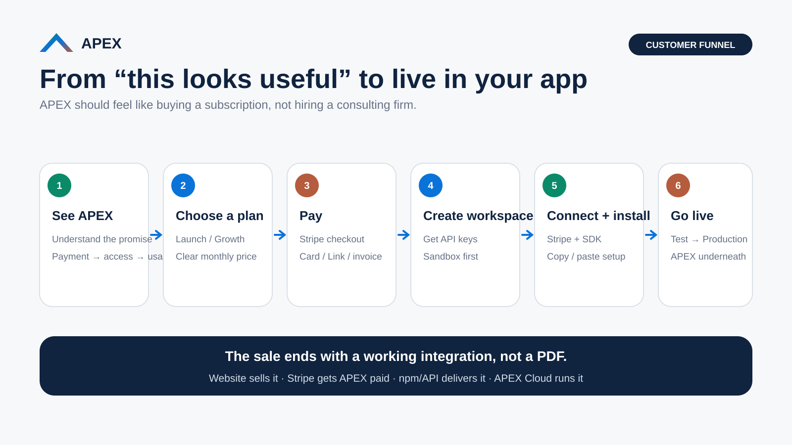
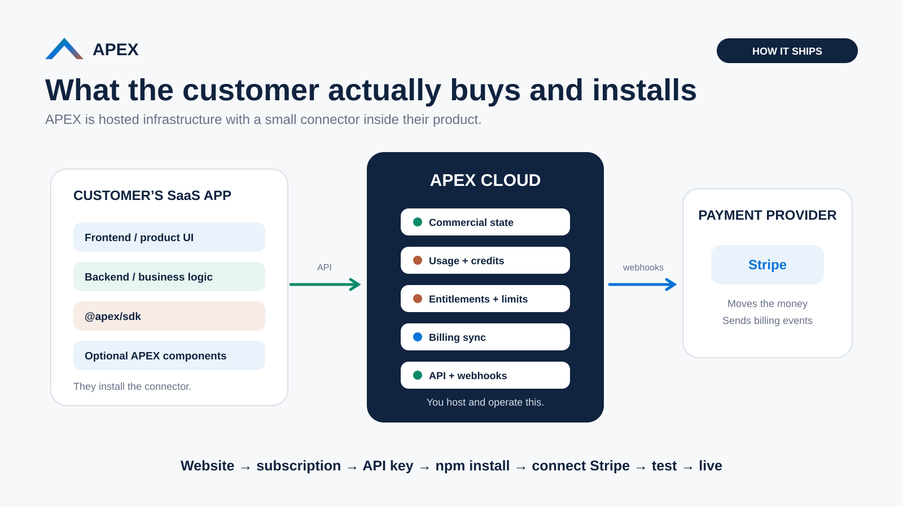
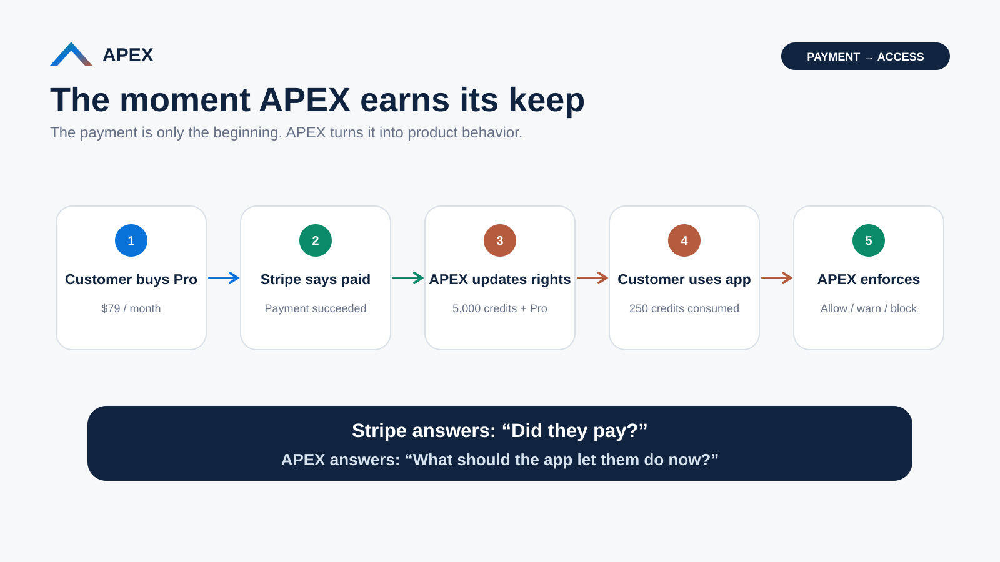
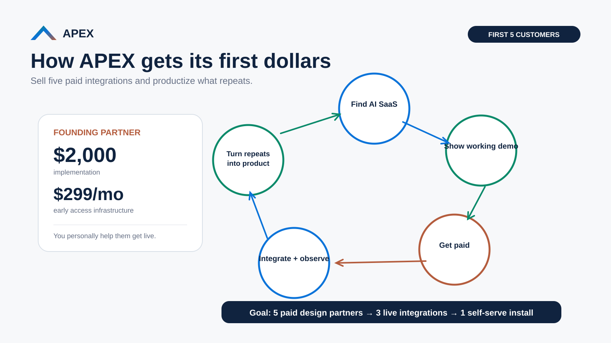

# APEX launch, distribution, and first-customer story

Use this document with `../ROADMAP.md` and `PRODUCT_CONTRACT.md`. The visuals here explain how APEX is bought, shipped, and understood; they do not prove backend capabilities are live.

## Product story

**Stripe moves the money. APEX knows what the money unlocks.**

For a SaaS company's end customer:

```text
Need more credits / tokens / coins / allowance
        ↓
SaaS product
        ↓
APEX
        ↓
SaaS company's connected Stripe account
        ↓
Verified payment
        ↓
APEX grant + balance + usage + access
```

## 1. Customer purchase funnel



**Story:** discover APEX → choose a plan → create account → pay APEX → get workspace → connect Stripe → install → verify/go live.

The current production funnel is only allowed to advance through the last acceptance-complete phase in `ROADMAP.md`. As of September 9, 2026, Phase 5 Connect Stripe is implemented but still waiting on the Stripe App External-test OAuth acceptance run.

## 2. How APEX ships



**Story:** the SaaS company eventually installs a thin `@apex/sdk` client in its server-side application. APEX itself remains hosted infrastructure. The SDK is planned Phase 7 and must not be represented as published until that phase passes.

Canonical architecture:

```text
Customer SaaS server → @apex/sdk / APEX API → APEX Cloud → connected Stripe
```

## 3. Payment to product access



**Story:** Stripe answers whether money moved. APEX maps the verified purchase to product state such as credits, plan rights, usage allowance, and `ALLOW`/`DENY` decisions.

The production promise includes:

- Stripe integration
- credit ledger
- usage metering
- entitlements
- purchase packs/top-ups
- renewals
- refunds/reversals
- audit history
- API/SDK
- customer balance UI

The minimum proof for that story is defined in `PRODUCT_CONTRACT.md` and Phase 8 of `../ROADMAP.md`.

## 4. First-five-customer revenue loop



**Story:** initially sell a guided implementation, get real SaaS teams live, observe repeated integration work, and productize the repeated path into API/SDK/self-service onboarding.

Do not confuse the current APEX Founding Partner test/launch pricing with permanent product pricing. Pricing should remain centrally configurable and may change before launch.

## Message hierarchy

Customer-facing copy should normally explain APEX in this order:

1. **Outcome:** your customer pays and receives the right product value.
2. **Simple mechanism:** Stripe moves the money; APEX keeps credits/usage/access correct.
3. **Developer mechanism:** API/SDK, webhooks, ledger, idempotency, entitlements.
4. **Operational proof:** balances, audit history, retries/reconciliation, refund/renewal behavior.

Avoid positioning APEX as a Stripe replacement or as a cryptocurrency/payment processor.

## Current visual-brand usage

The current implemented brand uses the canonical palette and typography in `docs/design/BRAND_SPEC.md`. Older green/blue/rust launch graphics remain explanatory assets; do not infer current UI colors or production status from those graphics.
